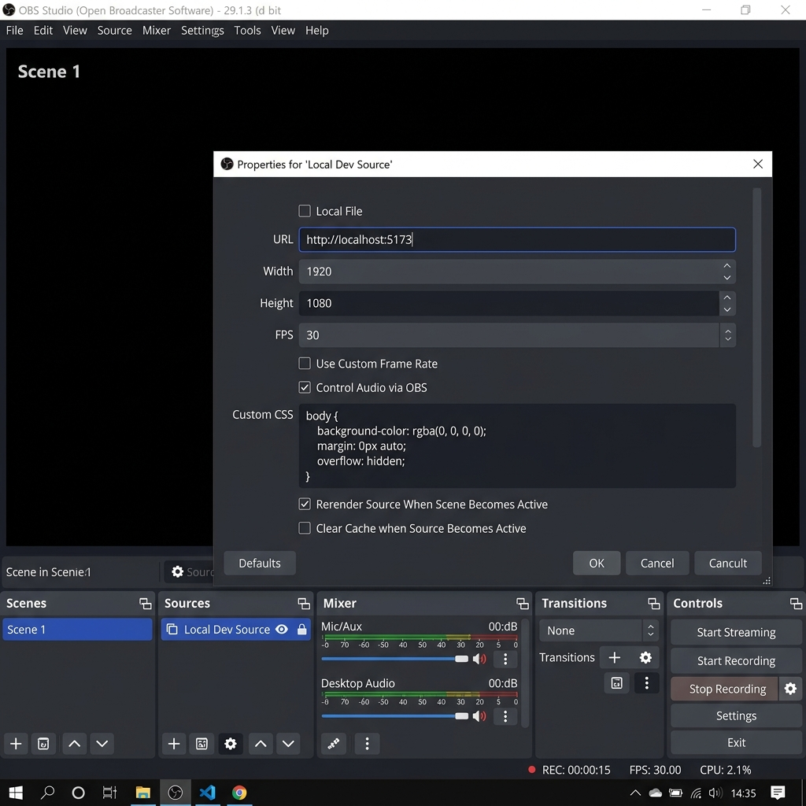
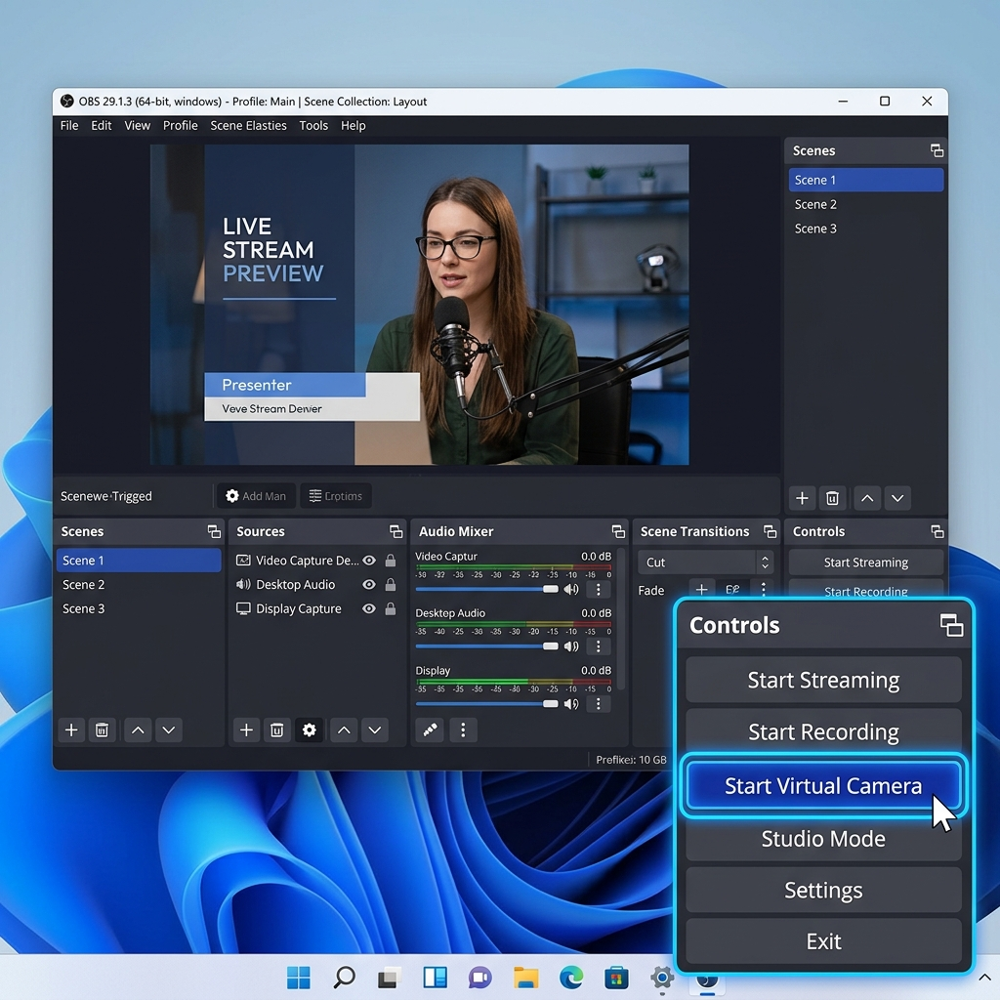
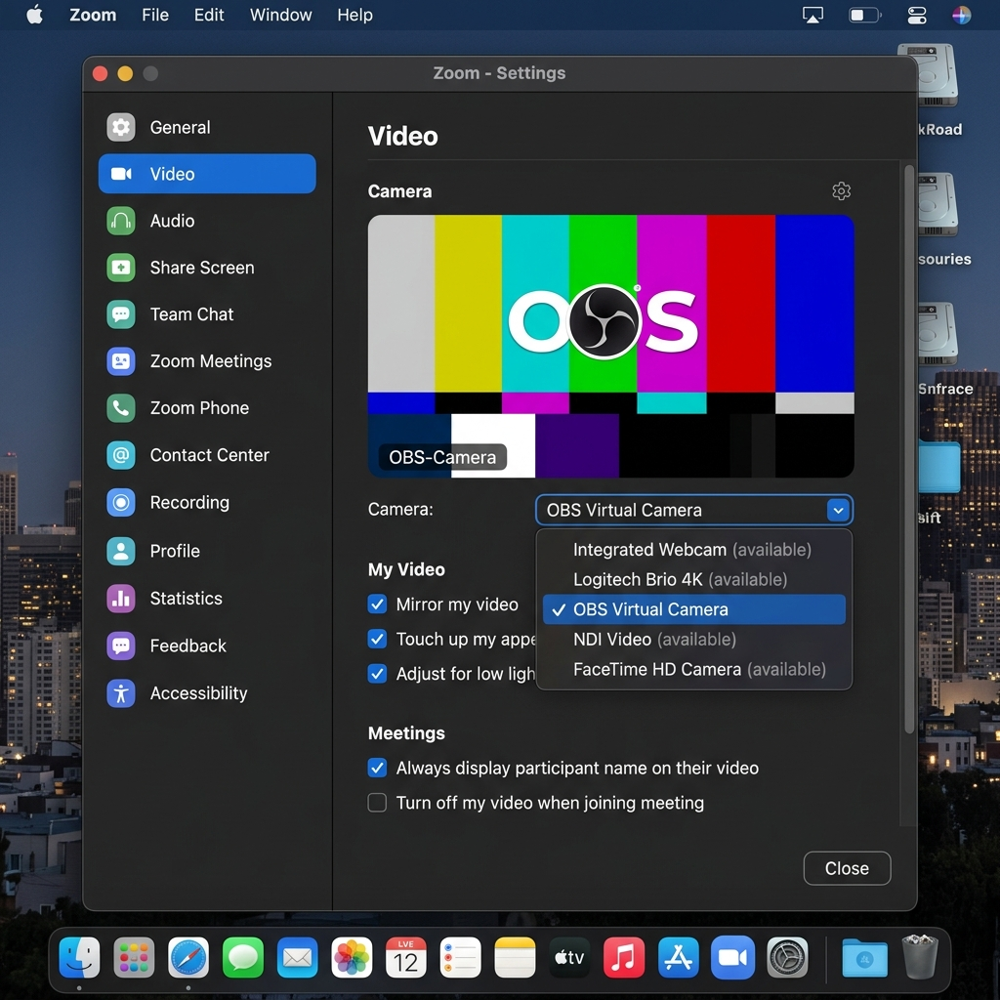
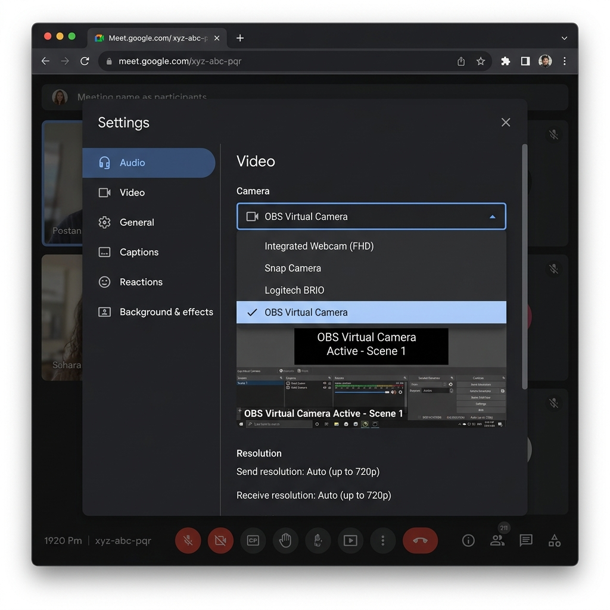
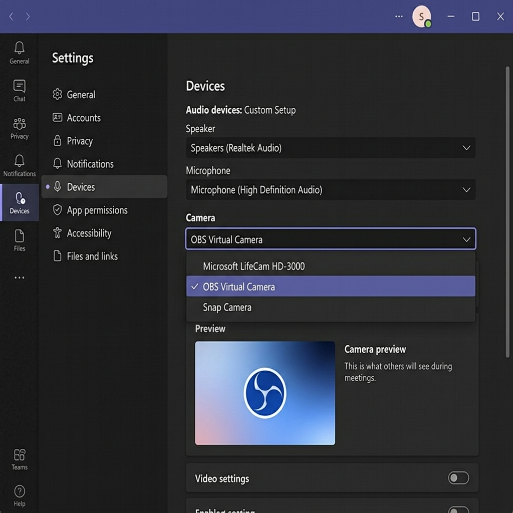

<!-- Documents the VoiceForge local development workflow, browser constraints, and MVP roadmap. -->
# VoiceForge

VoiceForge is a browser-based assistive video tool that lets a user type during calls and output cloned speech with a lip-synced face preview.

---

## 📑 Table of Contents

- [Why This Exists](#why-this-exists)
- [Tech Stack](#tech-stack)
- [Browser Compatibility](#browser-compatibility)
- [Prerequisites](#prerequisites)
- [Setup](#setup)
- [Environment Variables](#environment-variables)
- [Using VoiceForge In A Call](#using-voiceforge-in-a-call)
- [OBS Virtual Camera Setup](#obs-virtual-camera-setup)
- [API](#api)
- [Roadmap](#roadmap)
- [License](#license)
- [About](#about)

---

## Why This Exists

Deaf and speech-impaired people on video calls are often pushed into chat boxes, delayed interpretation, or awkward turn-taking. VoiceForge explores a local-first interface where typed intent can become spoken audio and a synchronized visual feed, helping the user participate in the same conversational channel as everyone else.

## Tech Stack


## Browser Compatibility

VoiceForge targets Chrome and Edge only. WebRTC Insertable Streams and canvas capture APIs are still uneven across browsers, so Firefox and Safari are not supported for the virtual camera MVP.

---

## Prerequisites

VoiceForge's voice cloning engine is **100% free** — no paid API plan, no account sign-up, and no API key required.

It is powered by [ResembleAI/Chatterbox-Multilingual-TTS](https://huggingface.co/spaces/ResembleAI/Chatterbox-Multilingual-TTS), a production-grade multilingual voice cloning model hosted as a public Hugging Face Space. The server connects to it using the official [`@gradio/client`](https://www.npmjs.com/package/@gradio/client) bridge package, which is installed automatically with `npm install`.

**What you need:**

- Node.js 18 or newer
- npm 9 or newer
- Chrome or Edge (for the virtual camera feature)
- An internet connection when running in live mode (see [Environment Variables](#environment-variables) for offline mock mode)

---

## Setup

1. Install Node.js 18 or newer.
2. From the repository root, install all dependencies (this includes `@gradio/client`):

```bash
npm install
```

3. Copy the example environment file:

```bash
cp .env.example .env
```

4. *(Optional)* Open `.env` and review the settings. The defaults run in offline mock mode, so no API key or internet access is needed. See [Environment Variables](#environment-variables) for the full reference.
5. Start the client and server together:

```bash
npm run dev
```

6. Open `http://localhost:5173` in Chrome or Edge.

---

## Environment Variables

All variables live in your local `.env` file (copy from `.env.example`). **None of them require a paid account or API key.**

| Variable | Default | Description |
| --- | --- | --- |
| `VOICE_ENGINE_SPACE` | *(commented out)* | The Hugging Face Gradio space used for voice synthesis. See the dual-mode setup below. |
| `MOCK_CHATTERBOX` | `true` | Controls whether the live AI or an offline test stub is used. See below. |
| `PORT` | `3001` | Express API port. |
| `CLIENT_URL` | `http://localhost:5173` | Allowed CORS origin for the Vite dev server. |
| `STREAM_SECRET` | *(auto-generated)* | AES-256-GCM signing key for speech stream tokens. Set a fixed value to survive server restarts. |

### Dual-Mode Voice Engine Setup

VoiceForge ships with two engine routing modes that you control entirely from `.env`:

#### Offline mock mode - local default

The checked-in `.env.example` uses mock mode by default:

```bash
MOCK_CHATTERBOX=true
```

This skips all Hugging Face network calls. The server returns a fixture `voice_id` instantly on clone and streams a short silent audio file on speak. This is ideal for contributors working on UI changes, automated CI pipelines, or offline environments.

> **Safety:** `MOCK_CHATTERBOX=true` has **no effect** when `NODE_ENV=production`. The server logs a yellow warning at startup whenever mock mode is active so it can never be silently enabled.

#### Live AI mode - official production engine

Leave `VOICE_ENGINE_SPACE` commented out with a `#`. The server will automatically route all synthesis requests to the official, lightning-fast production space:

```bash
# VOICE_ENGINE_SPACE=ResembleAI/Chatterbox-Multilingual-TTS
MOCK_CHATTERBOX=false
```

This is the recommended setting for end-users and deployed environments.

#### Live AI mode - independent backup mirror

If the official space is temporarily busy or you prefer to route through an independent mirror, uncomment the line and point it at the community-maintained backup:

```bash
VOICE_ENGINE_SPACE=itzzavdheshh/voiceforge-engine
MOCK_CHATTERBOX=false
```

This mirror runs the same Chatterbox Multilingual model. Useful when the primary space is under heavy load or during extended development sessions.

---

## Using VoiceForge In A Call

1. Open VoiceForge in Chrome or Edge.
2. Record a 10-second consent-based reference clip.
3. Clone the voice and continue to the Call page.
4. Allow webcam access.
5. Type a phrase and press Enter or Speak.
6. Turn on Go Live to expose the canvas stream inside the browser.
7. In Zoom, Google Meet, or Microsoft Teams, open camera settings and select the virtual camera source you have configured.

## OBS Virtual Camera Setup

Most video call apps cannot directly select a browser tab as a system camera. For the MVP, install [OBS Studio](https://obsproject.com/) and use OBS Virtual Camera as the bridge.

1. Install OBS Studio.
2. Add a **Browser Source** pointing to `http://localhost:5173`. Set the width to 1920 and height to 1080 to capture the full interface.

   

3. Crop the source to focus on the lip-synced output preview.
4. Click **Start Virtual Camera** in the OBS Controls panel.

   

5. Select **OBS Virtual Camera** as your camera in your preferred video call application.

### Video Call App Configuration

**Zoom:**
Go to Settings > Video > Camera and select **OBS Virtual Camera**.



**Google Meet:**
Go to Settings > Video > Camera and select **OBS Virtual Camera**.



**Microsoft Teams:**
Go to Settings > Devices > Camera and select **OBS Virtual Camera**.



**For detailed setup guides (including Discord and Webex) and troubleshooting tips, see our [Virtual Camera Guide](docs/virtual-camera.md).**

## API

| Method | Endpoint | Description |
| --- | --- | --- |
| `POST` | `/api/voice/clone` | Upload reference audio. Stores it server-side and returns a `voice_id`. No external API call in mock mode. |
| `POST` | `/api/voice/speak` | Send text, `voice_id`, and optional voice settings. Returns a signed `speechId` and streaming `audioUrl`. |
| `GET` | `/api/voice/speak/stream?t=<speechId>` | Stream the Chatterbox-generated audio for a pending signed speech token (`t`). Proxied from the Hugging Face Space. |
| `GET` | `/api/voice/status` | Returns current engine mode (`isMock`, `space`) for debugging. |
| `GET` | `/api/health` | Returns local API health status. |


## Roadmap

- Done: Store cloned voice profiles and reference audio Blobs in IndexedDB via `client/src/utils/db.js`.
- Done: Stream TTS audio through `POST /api/voice/speak` and `GET /api/voice/speak/stream`.
- Done: Replaced ElevenLabs with the free ResembleAI Chatterbox Multilingual TTS engine via `@gradio/client`.
- In progress: Voice tuning controls are wired through persisted `voice_settings`; multilingual output supports 23 languages via Chatterbox, with dedicated language controls in the UI.
- In progress: The MVP virtual camera uses canvas capture; full WebRTC Insertable Streams frame replacement remains future work.
- TODO: Replace the placeholder `models/wav2lip.onnx` with a real lightweight browser Wav2Lip ONNX model.
- TODO: Implement real ONNX Runtime Web Wav2Lip inference.
- Done: Replace the fallback mouth animation with model-driven mouth movement.
- Done: Add richer virtual camera documentation for OBS and each call provider.
- TODO: Add automated browser tests for camera and microphone permission flows.
- TODO: Persist voice profiles across server restarts (database or object-store backend).

## License

MIT
